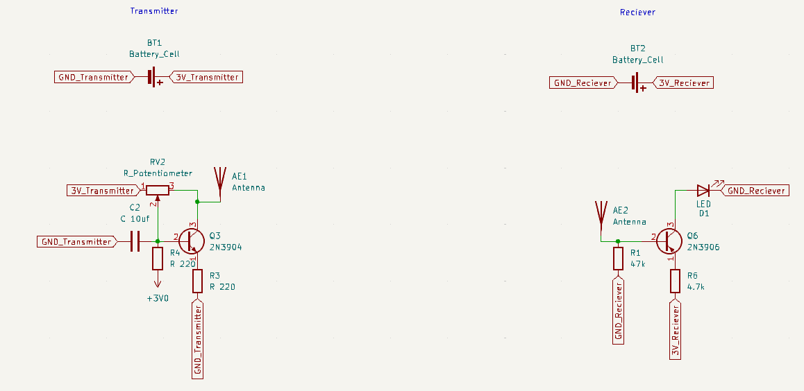
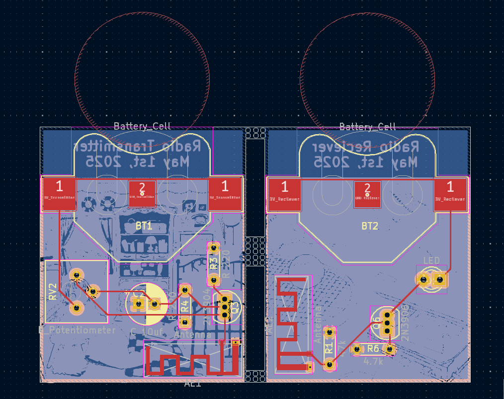
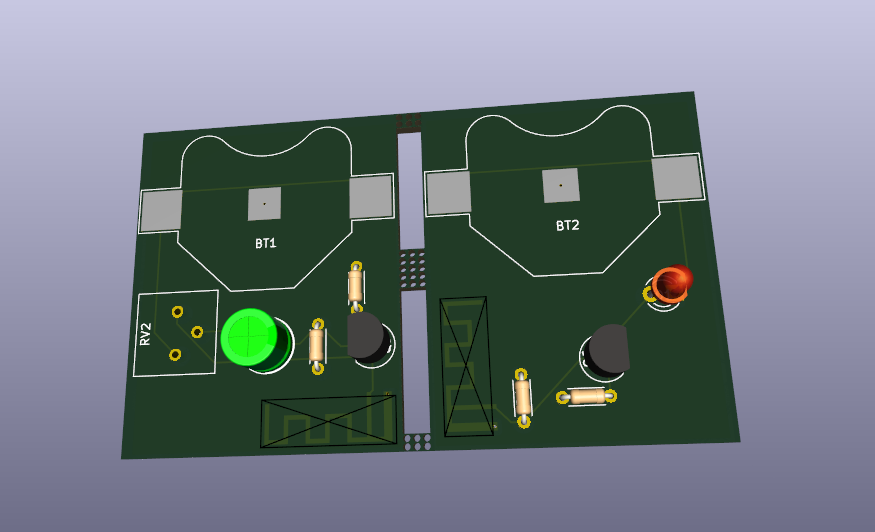

# PCB Beacon Radio Transmitter and Reciever

My pcb contains both a transmitter and reciever! 

## Schematic

## PCB

## Features
- Low power design! 3V operating voltage
- Can be tuned with the accelerometer
- Has a Colpitts-esque oscillator
- Built in antennas

## BOM
- 2 	Battery holder
- 1 	10uF Capacitor
- 1	  PNP Transistor
- 1	  NPN Transistor
- 1	  4.7k Resistor
- 1	  47k Resistor
- 2 	220 Resistor
- 1 	Potentiometer
- 1 	LED

Made by `@Laney` on slack :D

